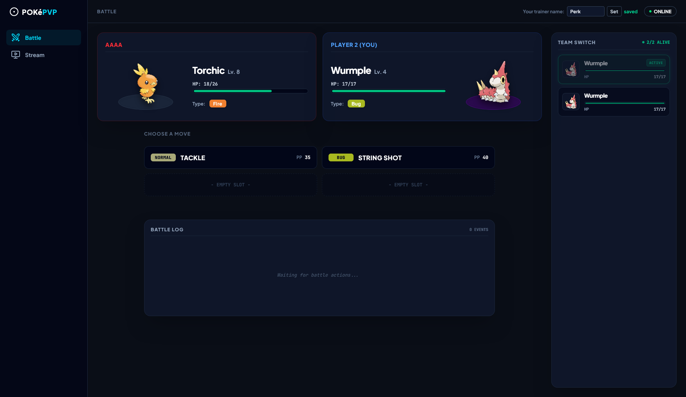
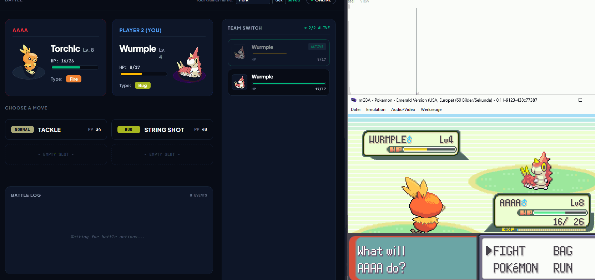
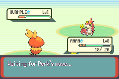
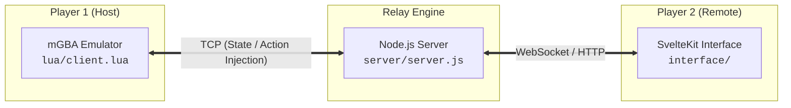

<div align="center">

# PokéPVP

**Real-time remote PvP engine for single-player Pokémon Emerald.**

Player 1 plays locally in the mGBA emulator. Player 2 connects via a modern web interface to control opposing trainers (moves, switches, ~~items~~) in real time, replacing the default game AI.

<p align="center">
  <a href="https://mgba.io/downloads.html"></a>
  <a href="https://nodejs.org/"></a>
  <a href="https://svelte.dev/"></a>
  <a href="https://tailwindcss.com/"></a>
  <a href="#prerequisites"></a>
</p>

</div>

---

## Overview

PokéPVP hooks into mGBA's execution loop via custom Lua memory manipulation. When Player 1 enters a trainer battle, the client halts the enemy AI execution, extracts active battle state (species, moves, PP, party status), and transmits it to a Node.js relay server.

Player 2 interacts with a web dashboard to select moves or switches, which are injected directly into mGBA's RAM prior to turn execution.

---

## Key Features

**Real-Time Command Dashboard:** Activates automatically upon entering a trainer battle. Player 2 views enemy party stats, real-time HP, types, and exact move PP.
<p align="center">

</p>

**Synchronized Turn Resolution:** Player 1's turn decision is hidden until Player 2 commits an action, executing both actions simultaneously in mGBA to prevent mid-turn counter-play.
<p align="center">

</p>

**Overworld Stream Preview:** Provides Player 2 with a low-framerate video stream of Player 1's game screen outside of battles.
<p align="center">

</p>

**Custom Display Name:** Player 2 can set a custom handle that replaces opposing trainer names in battle text.
<p align="center">

</p>

---

## Prerequisites

| Requirement | Specification | Notes |
| --- | --- | --- |
| **mGBA** | Development / Nightly Build | Requires support for `emu:setBreakpoint()`, which is unavailable in stable releases (`v0.10.x` or older). |
| **Game ROM** | Pokémon Emerald (US) | Header `BPEE`. Memory addresses are hardcoded specifically for this binary layout. |
| **Node.js** | `v18.0.0` or higher | Required for the relay server and web interface. |

---

## Quick Start

### 1. Repository Setup

Clone the repository and install dependencies for both the server and interface modules:

```bash
git clone https://github.com/lauchzelot/poke-pvp.git
cd poke-pvp

# Install dependencies
cd server && npm install
cd ../interface && npm install

```

### 2. Run the Relay Server

```bash
cd server
node server.js

```

### 3. Launch the Web Dashboard

```bash
cd interface
npm run dev

```

Navigate to `http://localhost:5173` (or the printed URL) in Player 2's browser.

### 4. Load the Emulator Script

1. Open **mGBA** and load the **Pokémon Emerald (US)** ROM.
2. Go to **Tools** → **Scripting...** → **File** → **Load Script**.
3. Select `lua/client.lua`.
4. Confirm successful loading in the mGBA console:

```text
[client] connected to relay
[client] PokePVP client.lua loaded (ROM: BPEE)

```

> [!WARNING]
> If the detected ROM header is not `BPEE`, memory addresses will misalign and command injection will fail.

---

## Network & Remote Configuration

By default, PokéPVP binds all sockets to `127.0.0.1`.

To play across different networks without port forwarding, host `server/server.js` on a public server or expose it using a reverse proxy/tunneling utility (e.g., Cloudflare Tunnel or ngrok).

Update the target connection URLs in the codebase:

* `RELAY_HOST` in `lua/client.lua`
* `WS_URL` in `interface/src/lib/battleConnection.svelte.ts`
* Screenshot URL in `interface/src/lib/components/ScreenPreview.svelte`

> [!NOTE]
> When serving the web interface over HTTPS, update WebSocket and image preview endpoints to `wss://` and `https://` respectively to satisfy browser CORS and security policies.

---

## Limitations

* **Item Usage:** In-battle item usage (e.g., Potions, battle items) by Player 2 is currently disabled pending further reverse-engineering of item execution memory offsets.

---

## Architecture



| Subsystem | Stack | Responsibility |
| --- | --- | --- |
| **Emulator Hook** | `Lua` | Intercepts turn decisions via breakpoints, reads battle state, and writes injected commands into RAM. |
| **Relay Server** | `Node.js` | Low-latency TCP-to-WebSocket bridge. Handles client messaging and serves live frame previews. |
| **Web Dashboard** | `SvelteKit` / `Tailwind` | Remote interface for Player 2 featuring active party management, move selection, and live logs. |

---

## Repository Structure

```text
pokepvp/
├── lua/
│   └── client.lua          # mGBA Lua RAM hooks, state extraction & turn injection
├── server/
│   └── server.js           # Node.js TCP <-> WebSocket relay & screenshot server
└── interface/              # SvelteKit + Tailwind remote web application
    └── src/
        ├── lib/            # State management, socket adapters, and UI components
        └── routes/         # Layouts, dashboard views, and routing logic

```

---

## Development & Acknowledgments

Built in collaboration with **Claude Code** (Anthropic). AI capabilities were leveraged for:

* Cross-referencing public symbol tables from the [pret/pokeemerald](https://github.com/pret/pokeemerald) decompilation project to map GBA memory offsets.
* Proposing and validating state-handling architecture for WebSocket synchronization.
* Generating static data registries for species, move indexes, and battle metadata (`interface/src/lib/data/`).